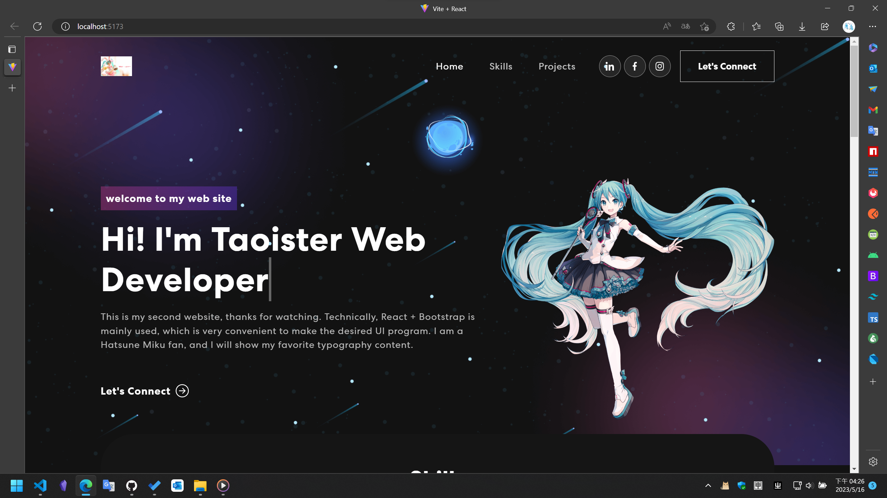

# Bootstrap 期末作業

## 截圖



## 來源

這個項目是基於[Youtube 視頻教程](https://www.youtube.com/watch?v=hYv6BM2fWd8&list=LL&index=99&t=1803s)，主要是借鑑了配色、字體、貼圖，大部分內容已經被我給重寫了，包括使用了`Vite`、`CSS Module`，這樣使項目更加的規範。

> 原項目[Github](https://github.com/judygab/web-dev-projects/tree/main/personal-portfolio)

## 說明

怎麽啓動項目（**注意，這是基於構建工具使用的前端開發，因此需要`Node.js`**）

```npm
npm install # 先安裝依賴
```

然後跑`Vite`

```npm
npm run dev # 開發環境下啓動
```

_這個是我`BootStrap`學校課程的期末作業_

`/server`目錄結構是什麼？

- 由於我們老師並不會`Node.js`下的前端構建方式，因此我用了`express`，直接將前端打包後的文件，作爲靜態服務器映射。主要是`Vite`是使用 ES 模塊，不然老師都無法給我的作業打分。同時將 `js` 打包成`exe`命令行工具。
